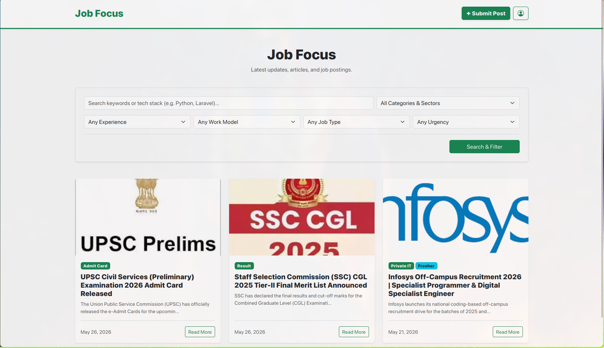
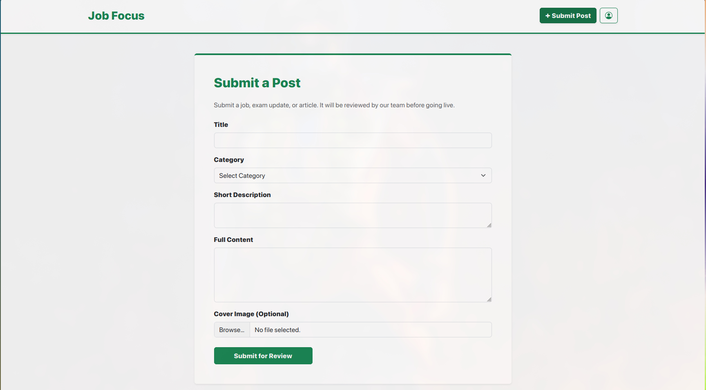
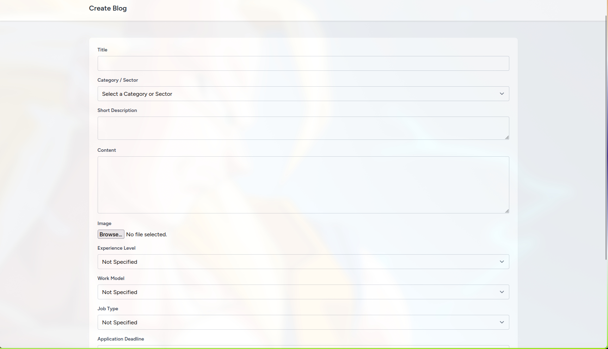
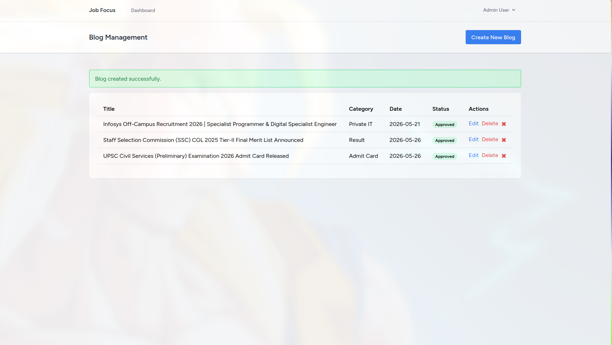

# Job focus Portal 🚀

A modern, dynamic web portal built with Laravel to manage and publish job updates, examination results, and admit cards. Designed with a clean UI and a robust backend to handle content management efficiently.

## ✨ Features

* **Dynamic Content Management:** Create, edit, and publish blog posts and updates instantly.
* **Categorization Engine:** Filter content by specific tags such as "Admit Card", "Result", and "Job Updates".
* **Secure Admin Dashboard:** Protected backend routing for content creators.
* **Media Handling:** Integrated image upload and serving capabilities.
* **Optimized Database:** Custom schema lengths configured for seamless deployment on restrictive shared hosting environments.
* **Advanced Filtering System:** Multi-parameter search including Experience Level, Work Model, Job Type, and application deadlines.
* **Smart Categorization:** Grouped UI dropdowns intelligently.
* **Community Submissions:** Public-facing submission portal allowing users to contribute job postings and articles.
* **Admin Moderation Workflow:** One-click approve/revoke toggle in the admin dashboard for managing community-submitted content.

---

## 📸 Screenshots

| Homepage & Filters | User Submission |
| :---: | :---: |
|  |  |
| **Admin Submission** | **Admin Dashboard** |
|  |  |

---

## 🛠️ Tech Stack

* **Framework:** Laravel 13
* **Language:** PHP 8.3
* **Database:** MySQL
* **Frontend:** Blade Templating, HTML5, CSS3
* **Environment:** Compatible with local setups (Linux/Arch, Windows, macOS) and shared hosting (Apache/cPanel/vPanel).

---

## 🚀 Local Installation & Setup

To get a local copy up and running on your machine, follow these steps:

### Prerequisites

* PHP >= 8.3
* Composer
* MySQL or MariaDB

### Steps

**1. Clone the repository:**
```bash
git clone https://github.com/dev-satyamjha/Job_focus.git
cd Job_focus
```

**2. Install Composer Dependencies:**
```bash
composer install
```

**3. Environment Setup:**
```bash
cp .env.example .env
```

Open the `.env` file and configure your local `DB_DATABASE`, `DB_USERNAME`, and `DB_PASSWORD`.

**4. Generate Application Key:**
```bash
php artisan key:generate
```

**5. Run Migrations & Seeders:**
```bash
php artisan migrate:fresh --seed
```

**6. Link Storage (For Images):**
```bash
php artisan storage:link
```

**7. Start the Development Server:**
```bash
php artisan serve
```

Visit `http://localhost:8000` in your browser.

---

## 🌍 Shared Hosting Deployment Guide (InfinityFree / cPanel)

This project has been specifically optimized to bypass common restrictions found on free and shared hosting platforms.

**1. PHP Version Compatibility:** Ensure your server is running PHP 8.3. If your local machine uses a newer version (e.g., PHP 8.5), enforce the platform target in Composer before uploading:
```bash
composer config platform.php 8.3.0
composer update
```

**2. Database String Limits:** The `AppServiceProvider.php` is pre-configured with `Schema::defaultStringLength(191);` to prevent `1071 Specified key was too long` errors on older MySQL servers.

**3. Session Management:** If deployment fails due to database connection delays during setup, update the server `.env` to use `SESSION_DRIVER=file`.

**4. Routing:** Place the provided `.htaccess` file in your `htdocs` or `public_html` root to silently route traffic to the Laravel `public/` directory without exposing core files.

**5. Storage Workaround:** If `exec()` is disabled on your host preventing `php artisan storage:link`, manually copy the contents of `storage/app/public` into `public/storage`.

---

## 🤝 Contributing

Contributions, issues, and feature requests are welcome! 

---

> **Note:**  This is a fun and demo project intended for learning the tech stack, do not infer any information from the site as they are just demo blogs.
